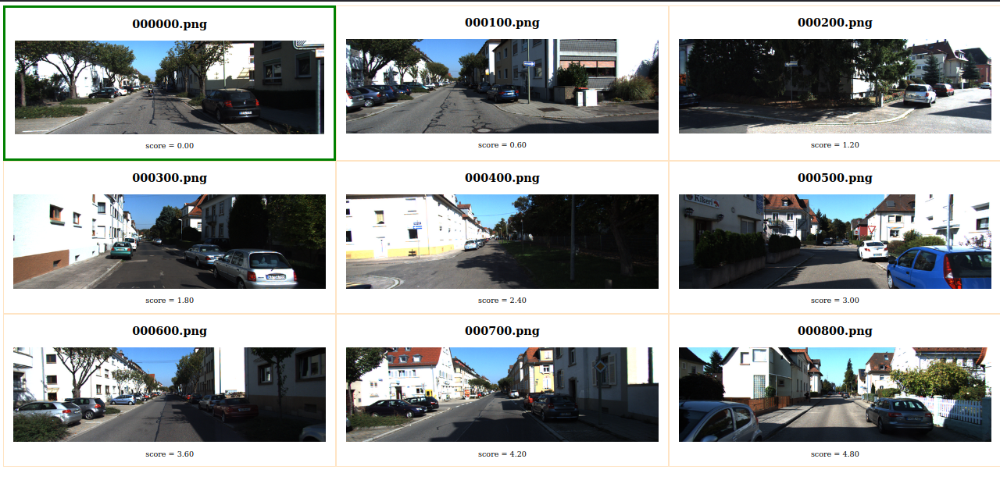

# Image Browser 

### It is a an HTML page created by printing <html> commands to STANDARD OUTPUT using C++.

[Web Page](web_app/image_browser.html)


Tejas Acharya [twitter](https://twitter.com/achte_te)

To Run:

```sh
git clone 
cd Image-Browser
bash install.sh
bash create_browser.sh
xdg-open ./web_app/image_browser.html
```

install.sh

```sh
#Tejas Acharya
# @achte_te
#!/usr/bin/env bash
echo "Running install.sh"

cd install && rm -rf *
cd ..
cd bin && rm -rf *
cd ..
cd build && rm -rf *
cmake ..
make
make install
cd ..
```

create_browser.sh

```sh
#Tejas Acharya
# @achte_te
#!/usr/bin/env bash
echo "Running create_browser.sh"

cd bin
./create_browser > ../web_app/image_browser.html
cd ..
```

HTML Page:
